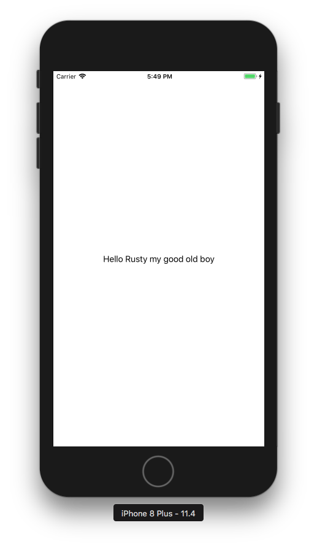
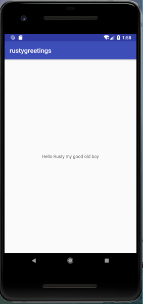

# Rusty Greetings 
##### A Rust shared library example for iOS and Android

  




## Rust install steps (mandatory)

Install Rust via:

`curl https://sh.rustup.rs -sSf | sh` 

Complete the installer using default install settings.


## iOS install steps

Rust comes with preinstalled packet manager cargo. For iOS you have to additionally install cargo-lipo:

`cargo install cargo-lipo`

Note: cargo-lipo does currently not support Bitcode. You find a more in-depth [explanation](https://github.com/Geal/rust_on_mobile/blob/master/README.md) here. Disabling Bitcode in Xcode settings via `ENABLE_BITCODE = NO` is currently the only option. 

Add iOS target architectures:

`rustup target add aarch64-apple-ios armv7-apple-ios armv7s-apple-ios x86_64-apple-ios i386-apple-ios`


## Android install steps

Install the following Android tools by going to *Android Studio > Preferences > ... > SDK Tools*: 

* Android SDK Tools
* NDK
* CMake
* LLDB

Add the following environment variables:

```
export ANDROID_HOME=/Users/$USER/Library/Android/sdk
export NDK_HOME=$ANDROID_HOME/ndk-bundle
```

Create standalone versions of the NDK to compile against. The *make_standalone_toolchain.py* script inside the Android NDK is used for this. Output is a folder called *ndk* inside the *android* folder of this project.

```
cd android
mkdir ndk
${NDK_HOME}/build/tools/make_standalone_toolchain.py --api 26 --arch arm64 --install-dir NDK/arm64
${NDK_HOME}/build/tools/make_standalone_toolchain.py --api 26 --arch arm --install-dir NDK/arm
${NDK_HOME}/build/tools/make_standalone_toolchain.py --api 26 --arch x86 --install-dir NDK/x86
```


Add a new template file called *cargo-config.toml.templ* that will contain information for cargo where to look for NDKs during cross compilation.
Replace *<project path>* with the path to the project on the current maschine. 

```
[target.aarch64-linux-android]
ar = "<project path>/rustygreetings_ios_android/android/ndk/arm64/bin/aarch64-linux-android-ar"
linker = "<project path>/rustygreetings_ios_android/android/ndk/arm64/bin/aarch64-linux-android-clang"

[target.armv7-linux-androideabi]
ar = "<project path>/rustygreetings_ios_android/android/ndk/arm/bin/arm-linux-androideabi-ar"
linker = "<project path>/rustygreetings_ios_android/android/ndk/arm/bin/arm-linux-androideabi-clang"

[target.i686-linux-android]
ar = "<project path>/rustygreetings_ios_android/android/ndk/x86/bin/i686-linux-android-ar"
linker = "<project path>/rustygreetings_ios_android/android/ndk/x86/bin/i686-linux-android-clang"
```

In order to make the SDKs visible for cargo the template file need to be copied to the *.cargo* directory in the user's home folder:

`cp cargo-config.toml.templ ~/.cargo/config`


Add the newly created Android architectures to rustup:

`rustup target add aarch64-linux-android armv7-linux-androideabi i686-linux-android`

There are no universal libraries for Android. Hence, separate libs for each target have to be created:

```
cd cargo
cargo build --target aarch64-linux-android --release
cargo build --target armv7-linux-androideabi --release
cargo build --target i686-linux-android --release
```

Create architecture folder and symlinks for Android Studio. Replace *<project path>* with the path to the project on the current maschine:

```
cd ../rustygreetings/app/src/main

mkdir jniLibs
mkdir jniLibs/arm64
mkdir jniLibs/armeabi
mkdir jniLibs/x86


ln -s <project_path>/rustygreetings_ios_android/android/cargo/target/aarch64-linux-android/release/libgreetings.so jniLibs/arm64/libgreetings.so
ln -s <project_path>/rustygreetings_ios_android/android/cargo/target/armv7-linux-androideabi/release/libgreetings.so jniLibs/armeabi/libgreetings.so
ln -s <project_path>/rustygreetings_ios_android/android/cargo/target/i686-linux-android/release/libgreetings.so jniLibs/x86/libgreetings.so

```


### Links and resources:
https://mozilla.github.io/firefox-browser-architecture/experiments/2017-09-06-rust-on-ios.html
https://mozilla.github.io/firefox-browser-architecture/experiments/2017-09-21-rust-on-android.html
https://www.bignerdranch.com/blog/building-an-ios-app-in-rust-part-1/
https://www.bignerdranch.com/blog/building-an-ios-app-in-rust-part-2/
https://www.bignerdranch.com/blog/building-an-ios-app-in-rust-part-3/
https://github.com/fluffyemily/cross-platform-rust
https://github.com/Geal/rust_on_mobile
https://github.com/SSheldon/rust-block
https://github.com/kennytm/rust-ios-androidhitecture/experiments/2017-09-21-rust-on-android.html